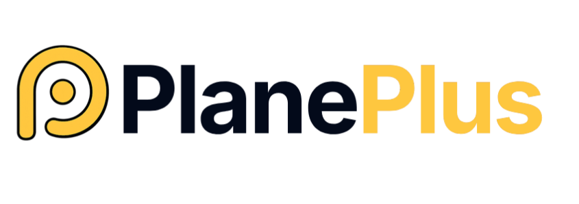

<br />

<p align="center">
  <picture>
    <source media="(prefers-color-scheme: dark)" srcset=".github/assets/plane-plus-lockup-light.svg">
    
  </picture>
</p>

<p align="center">
  <sub>Looking for the original upstream Plane README? →
  <a href="./README-PLANE.md"><b>README-PLANE.md</b></a></sub>
</p>

<h1 align="center">Plane Plus</h1>
<p align="center">
  <b>An AI-agent-first project management platform, built on <a href="https://plane.so">Plane</a>.</b>
</p>
<p align="center">
  by <a href="https://github.com/tools-plus">Tools Plus</a>
</p>

<p align="center">
  <a href="https://github.com/tools-plus"><b>GitHub</b></a> •
  <a href="https://github.com/tools-plus/plane-plus-sdk-mcp"><b>SDK & MCP server</b></a> •
  <a href="./README-PLANE.md"><b>Upstream Plane README</b></a>
</p>

## What is Plane Plus?

Plane Plus is an AI-agent-first fork of [Plane](https://plane.so), the open-source
project management tool. We extend Plane with agent-ergonomic APIs, markdown-native
pages, first-class epics, and a companion SDK + MCP server — so AI agents can plan,
delegate, track, and reflect using the same substrate humans do.

We track Plane upstream closely and contribute back where changes fit upstream
philosophy. Everything upstream Plane ships still works in Plane Plus — we only
add on top.

## What's different from upstream Plane

### API-key-authenticated v1 API

Upstream Plane authenticates via session cookie or JWT — great for browsers,
awkward for headless clients. We add a parallel `/api/v1/...` surface that
authenticates with a simple `X-Api-Key` header, so SDKs, scripts, and LLM agents
are first-class clients:

| Surface              | Example endpoint                                                                |
| -------------------- | ------------------------------------------------------------------------------- |
| Workspace wiki pages | `POST /api/v1/workspaces/<slug>/pages/`                                         |
| Page folders         | `POST /api/v1/workspaces/<slug>/page-folders/`                                  |
| Project pages        | `GET  /api/v1/workspaces/<slug>/projects/<project_id>/pages/`                   |
| Epics                | `POST /api/v1/workspaces/<slug>/projects/<project_id>/iw-epics/`                |
| Epic analytics       | `GET  /api/v1/workspaces/<slug>/projects/<project_id>/iw-epics/<id>/analytics/` |
| Intake (triage)      | Project intake endpoints for agent hand-offs                                    |

Grab an API key from your workspace settings, set `X-Api-Key: <key>`, go.

### Markdown round-trip on pages

Plane stores page content as HTML internally. Agents and CLIs work in markdown.
We bridge the two at the API boundary:

- **Write**: send `"content_format": "markdown"` alongside `description_html`
  → backend converts MD → HTML before storing.
- **Read**: add `?response_format=markdown` → backend converts stored HTML → MD
  on read, returned as `description_markdown`.

Storage stays HTML-only, no DB changes. Round-trip is lossless for standard
markdown (headers, lists, links, code, tables, emphasis, block quotes).

### Epics with analytics

- Dedicated `/api/v1/.../iw-epics/` endpoints so agents don't have to reason
  about Plane's polymorphic issue types.
- Analytics endpoint returns children-by-state, completion percentages, and
  other rollups ready to feed dashboards or progress reports.
- Hierarchy depth validation prevents accidentally nesting epic children N
  levels deep.

### Member-only project visibility

Tighter access control: a project can be restricted so only explicit members see
it, even within a workspace. Useful for multi-team workspaces where some
projects should stay private.

### Companion SDK + MCP server

Every endpoint above is typed and tool-callable via
[`plane-plus-sdk-mcp`](https://github.com/tools-plus/plane-plus-sdk-mcp) — a Python
SDK plus a FastMCP server. AI agents manage Plane workspaces without learning
the REST surface.

```python
from plane_sdk import PlaneClient

client = PlaneClient(api_key="...", workspace_slug="iwl-org")
epic  = client.create_epic(project_id="...", name="Q2 launch")
child = client.create_work_item(
    project_id="...", name="Ship metrics fix", parent_id=epic["id"],
)
```

MCP-aware agents (Claude Code, etc.) can do the same via tool calls:

```
mcp__plane__create_work_item(project_id="...", name="...", parent_id="<epic-id>")
```

## Installation

Plane Plus is a drop-in replacement for upstream Plane — same docker-compose,
same Kubernetes charts, same environment variables. Follow the upstream
[self-hosting guides](https://developers.plane.so/self-hosting/overview) and
point them at our image / this repository.

## Local development

Same workflow as upstream Plane — see [CONTRIBUTING.md](./CONTRIBUTING.md).

## Upstream: Plane

Plane Plus wouldn't exist without the excellent work of the Plane team.

- Upstream repository: [makeplane/plane](https://github.com/makeplane/plane)
- Upstream product: [plane.so](https://plane.so)
- Upstream docs: [docs.plane.so](https://docs.plane.so) and
  [developers.plane.so](https://developers.plane.so)
- Upstream README (snapshot at fork point): [README-PLANE.md](./README-PLANE.md)

## License

Plane Plus inherits the [GNU Affero General Public License v3.0](./LICENSE.txt)
from upstream Plane. All Plane Plus modifications are covered by the same
license.

## Security

- **Plane Plus-specific modifications** (anything under `plane/iw/…` in the API,
  or `iw-`-prefixed code): open a private security advisory via
  [GitHub](https://github.com/tools-plus/plane-plus/security/advisories/new).
- **Upstream Plane code**: please use upstream's channels — see
  [upstream security policy](https://github.com/makeplane/plane/blob/master/SECURITY.md).

## Contributing

Contributions are welcome. Where possible, we'd rather see upstream-compatible
improvements contributed to the upstream Plane project; Plane Plus-specific
additions (agent APIs, MCP integration, SDK features) belong here.

---

<p align="center">
  <em>Plane Plus is developed and maintained by
  <a href="https://github.com/tools-plus">Tools Plus</a>.</em>
</p>
